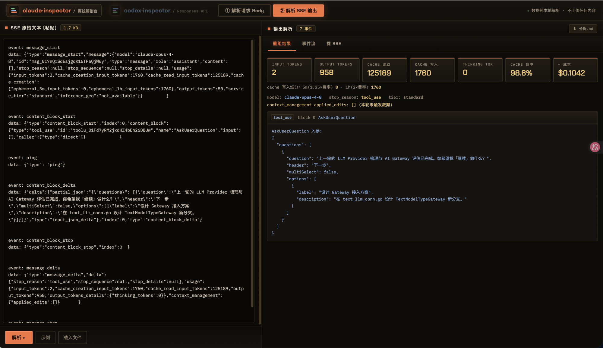
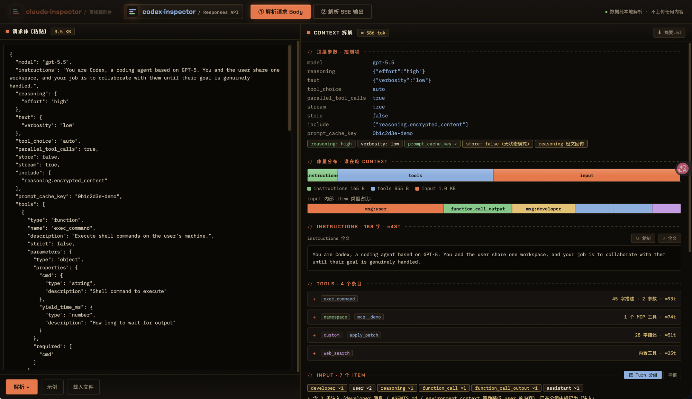

# Inspector

**Claude / Codex 请求与 SSE 解剖台** —— 一个纯前端、零依赖的离线解析工具。

在线使用：**https://inspector.evilstar.org**

把 Claude API（`/v1/messages`）或 Codex（OpenAI Responses API）的请求 Body / 返回的原始 SSE 流粘贴进去，可视化地看清一次请求的 context 由什么组成、一次响应的流由什么构成。所有解析都在浏览器本地完成，**不上传任何数据**。

点左上角品牌区在 **claude·inspector** 和 **codex·inspector** 两种模式间切换，每种模式都有「① 解析请求 Body」「② 解析 SSE 输出」两个 tab。

## 截图

**请求 Body 拆解** —— 顶层参数、体量分布、system / tools 逐块展开（下图为一个 304KB 真实 Claude Code 请求体的解析结果）：


**Context 拆解概览** —— 控制项、三大块占比条、messages 内部内容块占比、缓存断点：


**Agent loop 分组** —— 33 条消息自动切成 4 个 Turn，识别出 user 消息中的 tool_result 回填与 system-reminder 注入，并标记用户中断：


**工具参数树** —— 每个 tool 可切换「描述 / 参数树 / 原始 schema」，参数树展示类型、必填与说明：


**SSE 重组结果** —— usage 指标卡（含 cache 读写/命中率/成本估算）、stop_reason、把 delta 拼回的完整内容块：



**Codex 请求拆解** —— Responses API 的 instructions / tools / input 体量分布、reasoning·verbosity 控制项、四类工具与 input item 类型统计：



## 功能

### Claude 模式

#### ① 解析请求 Body（`/v1/messages` JSON）

- **体量分布** —— system / tools / messages 三大块占比，以及 messages 内部 `text` / `thinking` / `tool_use` / `tool_result` 各类型占比（看清"谁在吃上下文"）
- **顶层控制项** —— `thinking`、`output_config`、`context_management`、缓存断点（`cache_control`）等
- **Agent loop 分组** —— 自动识别"`role:user` 但实为 tool_result 回填"的消息，把扁平 messages 切成 **Turn（对话轮）→ Step（步骤）** 两层结构，每轮带泳道图（user › asst › tool › …）；tool_result 按 `tool_use_id` 配回发起调用的工具名，并标注成败
- **tools 三视图** —— 每个工具可切换「描述 / 参数树 / 原始 schema」，参数树展示类型、必填、enum、default、说明
- **system-reminder 识别** —— `role:"system"` 注入消息单独标记为「💉 注入」
- 消息关键字筛选、按 Turn 分组 / 平铺双视图

#### ② 解析 SSE 输出

- **重组结果** —— 把 `*_delta` 拼回完整 message（文本 / thinking / tool_use 入参），展示 `usage`（含 cache 读写、5m/1h 写入细分）、**cache 命中率**、**成本估算**（按官方价格表，cache 读 0.1×、写 5m=1.25× / 1h=2× 分别计费）、`stop_reason` / `stop_details`、`context_management.applied_edits`
- **事件流** —— 每个 SSE 事件按类型上色、可展开看原始 JSON，顶部有**类型过滤 chips**（一键屏蔽 ping / delta 噪音）
- **裸 SSE** —— 原始字节流原样呈现，高亮 `event:` / `data:`

### Codex 模式（OpenAI Responses API）

#### ① 解析请求 Body

- **体量分布** —— `instructions` / `tools` / `input` 三大块占比，input 内部按 item 类型（user/assistant 消息、reasoning、function_call、function_call_output…）细分
- **顶层控制项** —— `reasoning.effort`、`text.verbosity`、`prompt_cache_key`、`store: false`（无状态模式）、`reasoning.encrypted_content` 回传等
- **注入识别** —— Codex 把 AGENTS.md、`<environment_context>`、`<permissions>` 等伪装成 `role:user` / `developer` 消息注入，自动识别并标记为「💉 注入」，标明具体类型
- **Turn 分组** —— 真实用户输入切轮，reasoning / 工具调用 / 工具回填归入当前轮；`function_call_output` 按 `call_id` 配回工具名，解析 `metadata.exit_code` 标注成败
- **tools 四类适配** —— `function`（描述 / 参数树 / 原始 schema 三视图）、`custom`（如 apply_patch，展示语法约束 format）、`namespace`（MCP 服务器，可展开内部工具）、内置工具（web_search / tool_search）

#### ② 解析 SSE 输出

- **重组结果** —— 按 `output_index` 把 `response.output_text.delta` / `response.function_call_arguments.delta` / `response.reasoning_summary_text.delta` 拼回完整 output item；usage 展示 `cached_tokens`（缓存读取）、`reasoning_tokens`、**cache 命中率**、**成本估算**（按 OpenAI 官方价格表，缓存读折扣逐模型计：gpt-5 系 0.1×、gpt-4.1/o3 0.25×、gpt-4o 0.5×）
- **事件流** —— 按事件类别上色（created / added / delta / done / error），类型过滤 chips
- **裸 SSE** —— 原文高亮

### 通用

- 所有内容**不截断**：每段长文本都有「⧉ 复制」和「⤢ 全文弹窗」
- 输入自动持久化（localStorage），刷新不丢
- 拖拽文件直接导入；`⌘/Ctrl+Enter` 快捷解析
- 解析结果可**导出 Markdown** 摘要
- 每个页面都内置「示例」按钮，一键看效果

## 部署

这是一个 Cloudflare Worker + 静态资源项目，零构建：

```bash
npx wrangler deploy
```

`wrangler.toml` 里的自定义域名按需修改或删除（删掉 `routes` 段则使用默认的 `*.workers.dev` 域名）。

本地预览：

```bash
npx wrangler dev
# 打开 http://localhost:8787
```

也可以不用 Cloudflare —— `public/index.html` 是完全自包含的单文件，任何静态服务器（甚至 `file://` 直接打开）都能跑。

## 结构

```
inspector/
├── wrangler.toml      # Cloudflare Worker + 静态资源配置
├── src/index.js       # Worker：仅转发静态资源
└── public/
    ├── index.html     # 全部功能（解析 + 可视化），单文件，零依赖
    └── favicon.svg
```

## 说明

- token 数为粗估（CJK ≈1.6 字/tok、其余 ≈3.8 字/tok），精确计数请用 `/v1/messages/count_tokens`
- 成本估算基于内置价格表，模型价格变动时以官方为准：[Claude pricing](https://platform.claude.com/docs/en/pricing) / [OpenAI pricing](https://developers.openai.com/api/docs/pricing)
- Codex 走 chatgpt backend（订阅计费）时，成本估算反映的是「同样用量走 API 的价格」，主要用于观察 cache 命中对成本的影响
